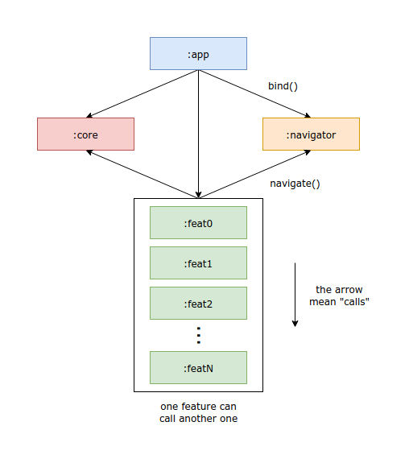

# News App

Android application using: 

- Jetpack Navigation
- Clean Architecture
- Modular Features
- View Binding
- Pagination Library

## Project Modularity: 

### Text explanation:
- *MainActivity* and *NavHost* resides within **:app** module. It also is responsible to bind the Navigator, inside **:navigator** module.
- Shared abstractions, *UseCases*, *Providers*, etc. resides within **:core** module.
- Navigation routes resides within **:navigator**.
- All modules except *:navigator* call **:core** module.
- Features can call another features using Navigator, from **:navigator**.

## Feature Architecture

### Text explanation:
- **View** is responsible for capturing user inputs and listening to *ViewModel* outputs.
- **ViewModel** is responsible for calling *UseCases* or navigating with the *Navigator*.
- **UseCases** are responsible for calling *Repositories*, *Mappers*, *Providers* or other *UseCases*.
- **Repositories** are responsible for calling theirs *DataSources*.
- **DataSources** can call *Remote servers* or *Local databases*.
